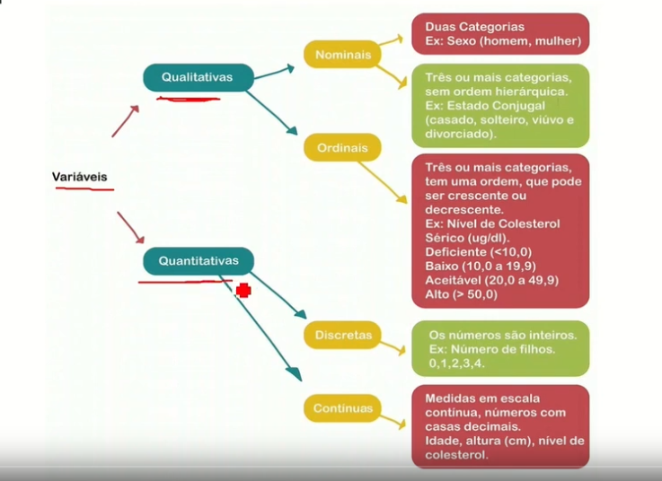
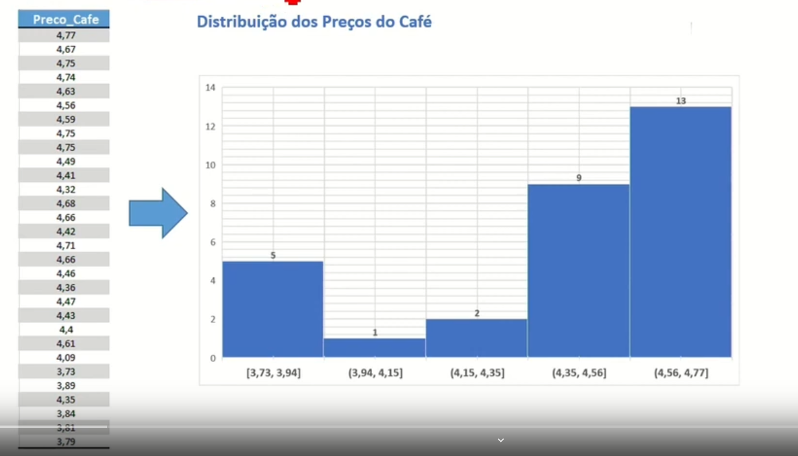
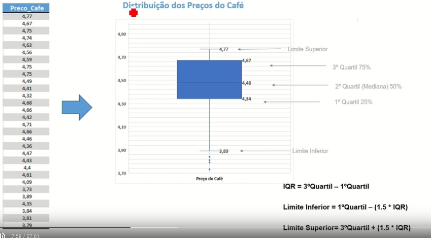
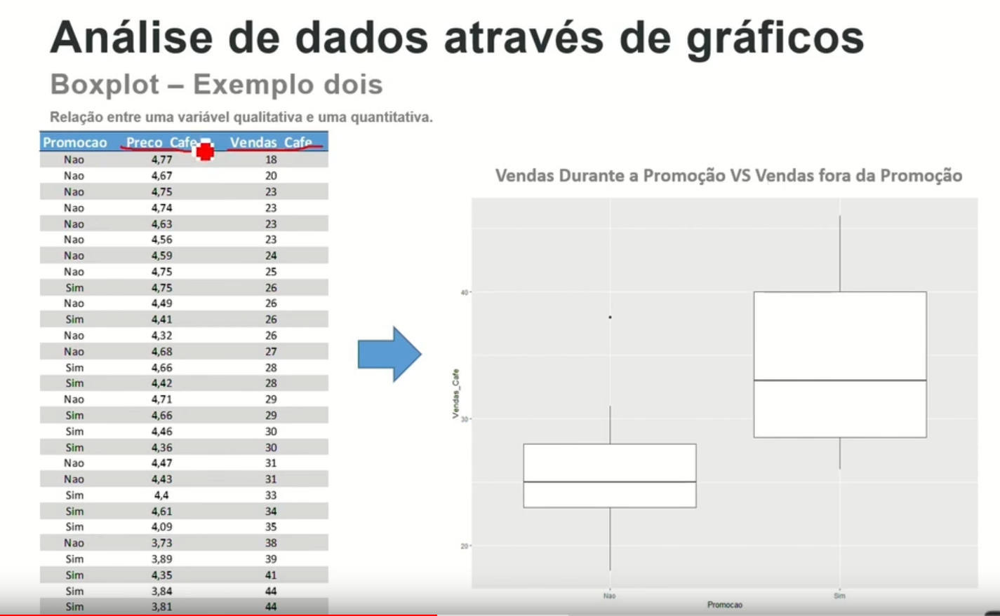
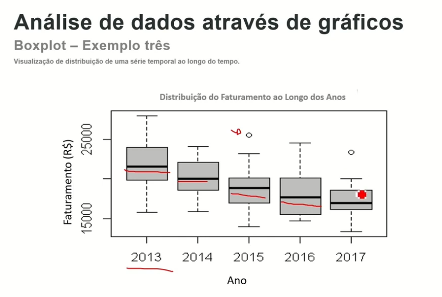
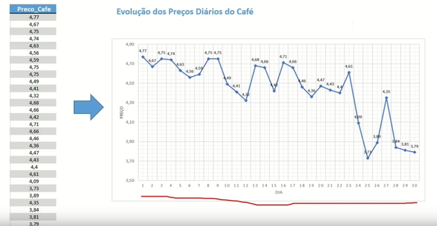
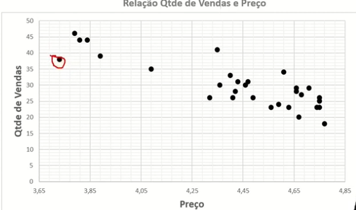
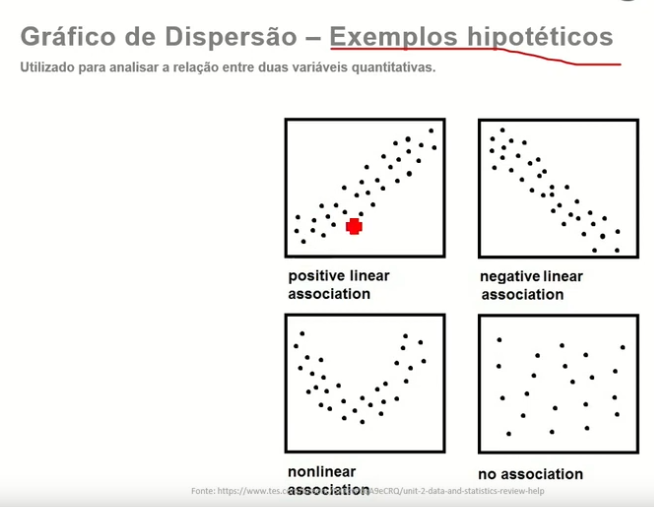

#### Nesta Aula

- Tipos de variáveis

- Histograma

- Boxplot

- Gráfico de linhas

- Gráfico de Setores

#### Tipos de variáveis

#### Histograma

Representação gráfica em barras, dividida em classes. A altura de cada barra representa a frequência com que o valor da classe ocorre. 

 
 
#### Boxplot.

Visualização de uma variável baseada em seus quartis.
  
 
 
O IQR (Amplitude de quartil) é últil para achar o limite do boxplot e definir o que é outlier e o que não é.
 
#### Boxplot exemplo 2.

Relação entre uma variável qualitativa e uma quantitativa.

#### Gráfico de linhas

Mostra a evolução de uma variável ao longo do tempo.

#### Gráfico de dispersão

Utilizado para anlaisar a relação entre duas variáveis quantitativas.

 
 
#### Gráfico de Setores 

Exibe a proporção de cada nível categórico de uma variável.
 
