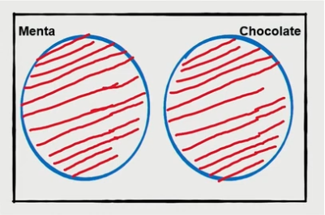
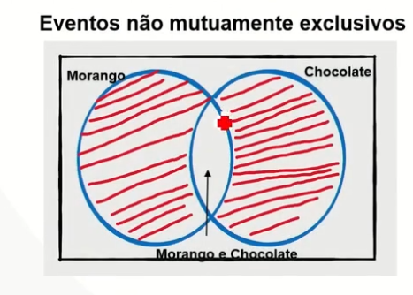

### Análie Estatística de Dados

#### Leis de probabilidade e diretrizes para sua aplicação

- Eventos aleatórios

- Probabilidade Frequentista

- Regra Aditiva

- Regra Multiplicativa

#### Eventos aleatórios

- Um experimento é aquele cujo resultado é incerto, embora se saiba quais são os resultados possíveis.

$$P(Sucesso)+P(Fracasso) = P(1)+P(0)=1$$
$$P(Fracasso) = 1-P(Sucesso)$$
#### Probabilidade Frequentista

Sendo A um evendo aleatório qualuqer, podemos enocntrar a probabilidade de A, utilizando a probabilidade frequentista.+

$$P(A)=\frac{Número De Vezes Que O Evento A Ocorrreu}{ Número Total De Observações}$$

$$P(Sucesso)+P(Fracasso) = P(1)+P(0)=1$$

De tal forma que:

$$0 \le P(A) \ge 1$$

#### Regra Aditiva

Operador OU - Probabilidade de um ou outro evento ocrrer.

- Eventos mutuamente exclusivos

$$P(Menta \cap Chocolate) = \phi$$

  - Dois eventos são eventos mutuamente exclusivos se eles não podem ocorrer ao mesmo tempo. Um exemplo disso é o lançamento de uma moeda, o qual pode resultar em cara ou coroa, mas não em ambos. 
  
- Eventos não mutuamente exclusivos

  - Dois eventos são não mutuamente exclusivos, se eles podem ocorrer ao mesmo tempo.
  
$$P(Morango) ou P(Chocolate)$$ 
 
$$P(Morango)\ +\ P(Chocolate)\ - P(Morango\ e\ Chocolate)$$ 
 
 $$P(Morango)\ ou\ P(Chocolate) = \frac{3}{10} + \frac{2}{10} - \frac{1}{10} = \frac{4}{10}$$ 
 
#### Regra Multiplicativa

Operador E - Probabilidade de um e outro evento aleatório ocorrer.
  